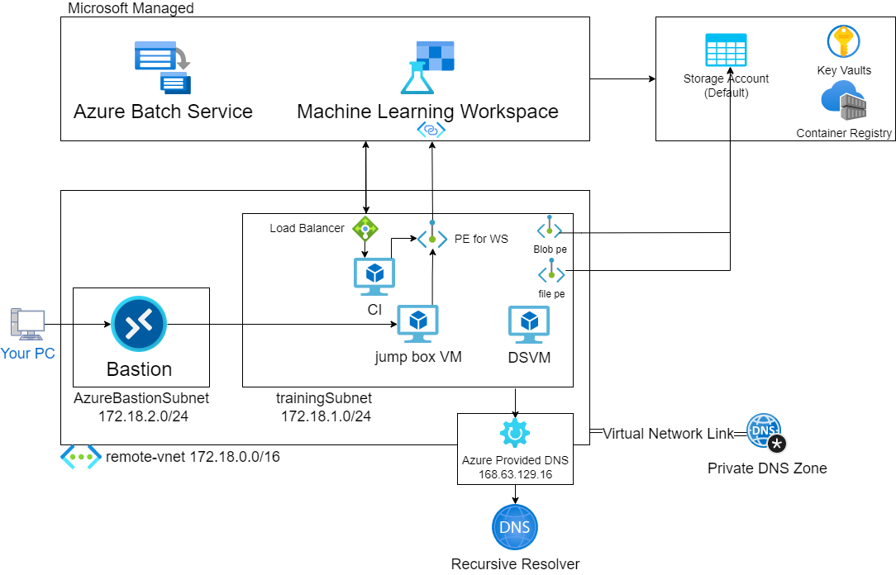

# azureml-with-nostorage-access
This is Project to create azureml project (using dsvm etc) with no storage access

## This Project Environment
- SDK: `azureml-core = 1.38.0`
  - if your sdk version is less than `1.38.0`, please upgrade by entering `pip install azureml-core==1.38.0`
- used DSVM: `Data Science Virtual Machine - Ubuntu 18.04 - Gen 2 (Standard DS1 v2)`

## Condition
- DSVM is in the same subnet (eg. `TrainingSubnet`) as private-endpoint to AML Workspace
- NSG assigned to subnet `TrainingSubnet` blocks Outbound to `Storage` service tag
  - *if you clone from notebook sample, download from `OpenDatasets`, or recreate Computing Instance/Computing Cluster, you need to allow Outbound to `Storage` service tag*
- Default Storage in Workspace is private-link connected with subnet `TrainingSubnet`
  - *if you create private-endpoint in Azure Portal, private-endpoint-network-policy is disabled by default. otherwise, check it.*
  - *check whether the private-endpoint to Default Storage is created with `target-subresource` of both `blob` and `file`*

## Overview

